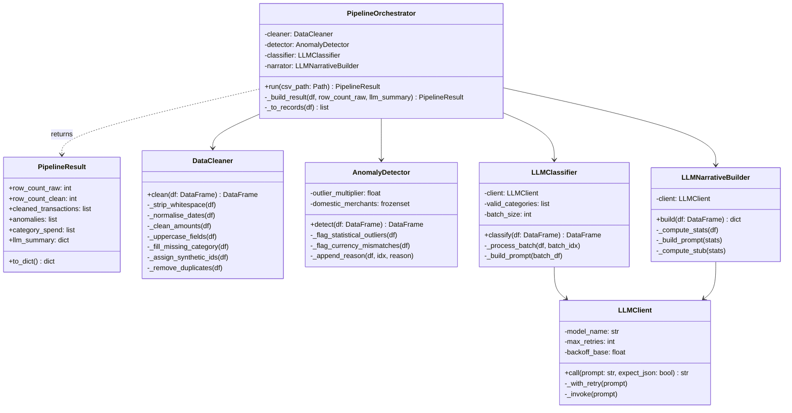

# Architecture

## Overview

The system is a Django REST Framework API that processes dirty financial CSV files through an AI-powered pipeline.

```
CSV Upload → Job (DB) → Celery Task → Pipeline → Results (DB)
```

All business logic lives in `zserver/services/` — **no Django imports** inside services, so every class is independently testable.

---

## Directory Structure

```
zserver/
├── models.py               # ORM: Job, Transaction, JobSummary
├── tasks.py                # Celery task stub (process_job)
├── views.py                # DRF API endpoints
└── services/
    ├── cleaner.py          # DataCleaner
    ├── anomaly.py          # AnomalyDetector
    ├── pipeline.py         # PipelineOrchestrator + PipelineResult
    └── llm/
        ├── client.py       # LLMClient  (Gemini SDK + retry)
        ├── classifier.py   # LLMClassifier  (batch categorise)
        └── narrator.py     # LLMNarrativeBuilder  (summary call)
```

---

## Class Diagram



---

## Design Principles

| Principle | How it's applied |
|---|---|
| **Single Responsibility** | Each class does exactly one thing — `DataCleaner` only cleans, `AnomalyDetector` only flags, etc. |
| **Dependency Injection** | `PipelineOrchestrator`, `LLMClassifier`, and `LLMNarrativeBuilder` all accept collaborators in `__init__` — swap mocks in tests |
| **Open/Closed** | Add a new anomaly rule by adding a private method to `AnomalyDetector` — callers unchanged |
| **No Django in services** | `zserver/services/` has zero ORM imports — pure pandas/stdlib, independently testable |
