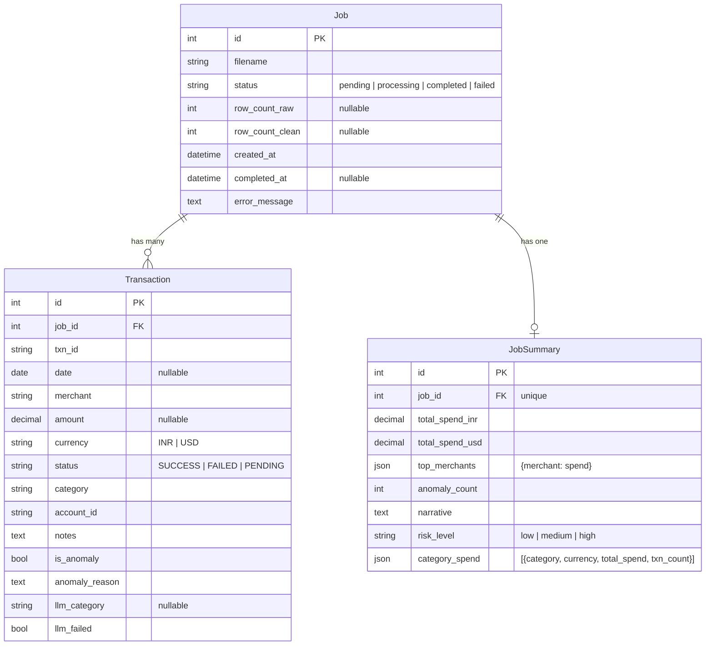

# Database

SQLite (dev). 3 models, 2 foreign-key relationships.

---

## ER Diagram



---

## Model Reference

### `Job`

| Field | Type | Notes |
|---|---|---|
| `id` | AutoField PK | |
| `filename` | CharField(255) | original upload name |
| `status` | CharField(20) | `pending / processing / completed / failed` |
| `row_count_raw` | IntegerField | set after pipeline runs |
| `row_count_clean` | IntegerField | set after pipeline runs |
| `created_at` | DateTimeField | auto |
| `completed_at` | DateTimeField | nullable |
| `error_message` | TextField | blank unless failed |

**Status transitions (methods on model):**
```
pending → mark_processing() → processing
processing → mark_completed() → completed
processing → mark_failed()    → failed
```

---

### `Transaction`

One row per cleaned CSV line, linked to the parent `Job`.

| Field | Type | Notes |
|---|---|---|
| `job` | FK → Job | CASCADE delete |
| `txn_id` | CharField(50) | synthetic (`SYN0001`) if blank in source |
| `date` | DateField | ISO 8601, nullable if unparseable |
| `merchant` | CharField(200) | |
| `amount` | DecimalField(12,2) | nullable |
| `currency` | CharField(3) | uppercased: `INR` / `USD` |
| `status` | CharField(20) | uppercased: `SUCCESS` / `FAILED` / `PENDING` |
| `category` | CharField(50) | source value or `Uncategorised` |
| `account_id` | CharField(50) | |
| `notes` | TextField | |
| `is_anomaly` | BooleanField | set by `AnomalyDetector` |
| `anomaly_reason` | TextField | pipe-separated if multiple rules match |
| `llm_category` | CharField(50) | nullable — only set when LLM runs |
| `llm_failed` | BooleanField | True if LLM batch failed for this row |

---

### `JobSummary`

Created once, after the pipeline completes. One-to-one with `Job`.

| Field | Type | Notes |
|---|---|---|
| `job` | OneToOneField → Job | CASCADE delete |
| `total_spend_inr` | DecimalField(14,2) | |
| `total_spend_usd` | DecimalField(14,2) | |
| `top_merchants` | JSONField | `{"Swiggy": 5000, ...}` |
| `anomaly_count` | IntegerField | |
| `narrative` | TextField | LLM-generated 2–3 sentence summary |
| `risk_level` | CharField(10) | `low / medium / high` |
| `category_spend` | JSONField | `[{category, currency, total_spend, txn_count}]` |
