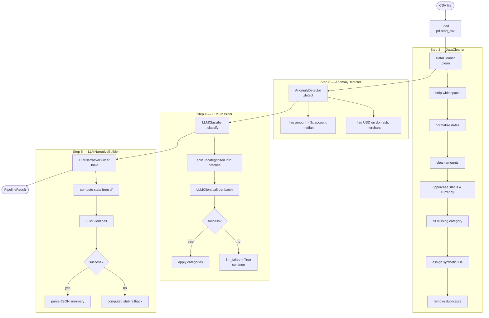

# Pipeline

The processing pipeline is a sequence of 5 ordered steps executed by `PipelineOrchestrator.run()`.

---

## Data Flow



---

## Step Details

### Step 1 — Load
- `pd.read_csv(csv_path, dtype=str)` — reads everything as string to avoid type coercion
- Drops completely empty rows

### Step 2 — `DataCleaner`
| Sub-step | What it does |
|---|---|
| Strip whitespace | `str.strip()` on all object columns |
| Normalise dates | Tries `DD-MM-YYYY`, `YYYY/MM/DD`, `YYYY-MM-DD`, US fallback → ISO 8601 |
| Clean amounts | Strips `$` and non-numeric chars, casts to `float` |
| Uppercase fields | `status` and `currency` uppercased |
| Fill category | Blank/NaN → `'Uncategorised'` |
| Synthetic IDs | Blank `txn_id` → `SYN0001`, `SYN0002`, … |
| Dedup | Drops exact duplicates on `[txn_id, date, merchant, amount, currency, status, account_id]` |

### Step 3 — `AnomalyDetector`
| Rule | Condition | `anomaly_reason` |
|---|---|---|
| Statistical outlier | `amount > 3 × account_id median` | `"amount (X) > 3x account median (Y)"` |
| Currency mismatch | `currency == USD` and merchant in domestic set | `"USD on domestic-only merchant 'X'"` |

Both rules can flag the same row — reasons are pipe-separated.

### Step 4 — `LLMClassifier`
- Only targets rows where `category == 'Uncategorised'`
- Rows are chunked into batches of 20
- One `LLMClient.call()` per batch (prompt → JSON `{txn_id: category}`)
- On failure: sets `llm_failed = True` for that batch, **continues** — never aborts the job
- Invalid category values fall back to `"Other"`

### Step 5 — `LLMNarrativeBuilder`
- Computes aggregate stats (total spend, top merchants, anomaly count, category spend)
- One `LLMClient.call()` → structured JSON summary
- Falls back to a computed stub if the call fails
- Returns: `total_spend_inr/usd`, `top_merchants`, `anomaly_count`, `narrative`, `risk_level`

---

## LLMClient Retry Logic

```
attempt 1 ──► fail ──► wait 2^1 + jitter s
attempt 2 ──► fail ──► wait 2^2 + jitter s
attempt 3 ──► fail ──► raise LLMError
```

`LLMClassifier` catches `LLMError` per batch → marks `llm_failed`, continues.  
`LLMNarrativeBuilder` catches it → uses computed stub.

---

## Output Shape (`PipelineResult`)

```python
PipelineResult(
    row_count_raw        = 90,
    row_count_clean      = 85,
    cleaned_transactions = [...],   # list of dicts, one per row
    anomalies            = [...],   # subset of above where is_anomaly=True
    category_spend       = [...],   # [{category, currency, total_spend, txn_count}]
    llm_summary          = {
        "total_spend_inr": 52000.0,
        "total_spend_usd": 1200.0,
        "top_merchants":   {"Flipkart": 18000, ...},
        "anomaly_count":   10,
        "narrative":       "...",
        "risk_level":      "high",
    },
)
```
